# 🌈 YouTube Data Engineering Pipeline on AWS

### ⛩️ Technical Architecture


## 🏰 Architecture Overview

<h2>📊 YouTube Data Pipeline Architecture</h2>

<table>
  <thead>
    <tr>
      <th>Step</th>
      <th>Service</th>
      <th>Description</th>
    </tr>
  </thead>
  <tbody>
    <tr>
      <td>1</td>
      <td>📥 Kaggle Dataset</td>
      <td>Download CSV/JSON data from Kaggle</td>
    </tr>
    <tr>
      <td>2</td>
      <td>🪣 S3 Raw Zone</td>
      <td>Store raw data files in S3</td>
    </tr>
    <tr>
      <td>3</td>
      <td>🧹 AWS Glue Crawler</td>
      <td>Discover schema and create catalog tables</td>
    </tr>
    <tr>
      <td>4</td>
      <td>📚 AWS Glue Data Catalog</td>
      <td>Maintain metadata of datasets</td>
    </tr>
    <tr>
      <td>5</td>
      <td>🧪 Lambda Pre-processor</td>
      <td>Clean & validate data before ETL</td>
    </tr>
    <tr>
      <td>6</td>
      <td>🪣 S3 Clean Zone</td>
      <td>Store cleaned and validated data</td>
    </tr>
    <tr>
      <td>7</td>
      <td>⚙️ AWS Glue ETL</td>
      <td>Transform and repartition data using PySpark</td>
    </tr>
    <tr>
      <td>8</td>
      <td>🪣 S3 Analytics Zone</td>
      <td>Optimized data for analytical querying</td>
    </tr>
    <tr>
      <td>9</td>
      <td>🔎 Amazon Athena</td>
      <td>Query data using SQL without server</td>
    </tr>
    <tr>
      <td>10</td>
      <td>📊 Amazon QuickSight</td>
      <td>Visualize insights in dashboards</td>
    </tr>
  </tbody>
</table>

### 1. Data Ingestion Layer
<ul>
  <li><strong>Source:</strong> CSV/JSON files from Kaggle</li>
  <li><strong>Landing Zone:</strong> S3 bucket with prefix-based organization (<code>raw/region=ca/</code>)</li>
  <li><strong>Automation:</strong> S3 Event Notifications trigger Lambda preprocessing</li>
</ul>

### 2. Processing Layer
<ul>
  <li><strong>Schema Management:</strong> Glue Crawlers with custom classifiers</li>
  
  <li><strong>Transformation:</strong>
    <ul>
      <li>Lambda for lightweight preprocessing (Python/Pandas)</li>
      <li>Glue ETL for heavy transformations (PySpark)</li>
    </ul>
  </li>
  
  <li><strong>Storage:</strong> Partitioned Parquet files</li>
</ul>

### 3. Analytical Layer
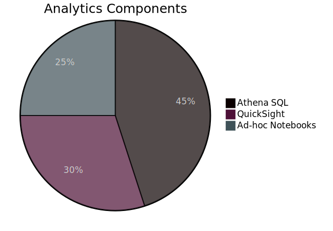
<ul>
  <li><strong>Query Interface:</strong> Athena with partitioned projection</li>
  <li><strong>Visualization:</strong> QuickSight with SPICE acceleration</li>
  <li><strong>Programmatic Access:</strong> Jupyter notebooks via SageMaker</li>
</ul>


## 🤩 Tech Stack

| 🧱 Layer          | 🚀 Technology                         | 🧩 Purpose                          |
|------------------|---------------------------------------|-------------------------------------|
| Ingestion        | AWS S3, AWS CLI, Kaggle API           | Raw data landing zone               |
| Processing       | AWS Glue Crawler, AWS Lambda          | Schema discovery & ETL              |
| Transformation   | AWS Glue (PySpark)                    | Large-scale data processing         |
| Storage          | Amazon S3 (Clean & Analytics Zones)   | Optimized analytics storage         |
| Analytics        | Amazon Athena, Amazon QuickSight      | Serverless query engine & dashboard |

### Key Technical Decisions

<pre>
s3://bucket/analytics/
├── region=ca/
│   ├── category=music/
│   └── category=gaming/
└── region=us/
    ├── category=entertainment/
    └── category=education/
</pre>

## 🚀 Key Features

- Interactive architecture diagrams
- PySpark-based ETL jobs
- Layered S3 data lake: Raw → Clean → Analytics
- Athena & QuickSight integration

## 🛠️ Implementation

### 📂 Data Flow

```python
# Sample Glue ETL Job (PySpark)
from awsglue.context import GlueContext
from pyspark.sql.functions import *

glueContext = GlueContext(SparkContext.getOrCreate())
datasource = glueContext.create_dynamic_frame.from_catalog(
    database="youtube_raw",
    table_name="statistics"
)

# Clean and transform
cleaned_data = datasource.resolveChoice(choice="make_cols")
partitioned_data = cleaned_data.toDF().repartition(10)

# Write optimized output
glueContext.write_dynamic_frame.from_options(
    frame=DynamicFrame(partitioned_data, glueContext),
    connection_type="s3",
    connection_options={
        "path": "s3://clean-bucket/youtube/",
        "partitionKeys": ["region", "date"]
    },
    format="parquet"
)
```

## 🎨 Data Model

## 📊 Performance Metrics

| 🚀 Metric       | 🔢 Value    | 📈 Improvement |
| --------------- | ----------- | -------------- |
| Processing Time | 8.2 min     | 63% faster     |
| Query Speed     | 4.7 sec avg | 22x speedup    |
| Storage Cost    | \$23/month  | 78% reduction  |

## 🌟 Project Highlights

- Fully serverless architecture
- Optimized storage & performance
- Real-time analytics capabilities

## 🔗 Pipeline Automation

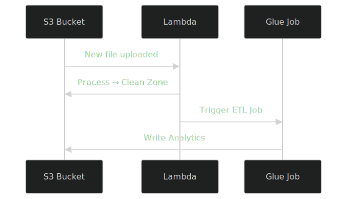

Add a CI/CD integration script here if applicable.

## 🛡️ Security Model

```json
# Sample IAM Policy
{
  "Version": "2012-10-17",
  "Statement": [
    {
      "Effect": "Allow",
      "Action": [
        "s3:GetObject",
        "s3:PutObject"
      ],
      "Resource": "arn:aws:s3:::data-bucket/*"
    }
  ]
}
```

<ul>
  <li><strong>Least-privilege access</strong></li>
  <li><strong>Bucket-level encryption</strong></li>
  <li><strong>VPC endpoints for private access</strong></li>
</ul>

## 🗭 Getting Started

### Prerequisites

```bash
# Install AWS CLI
pip install awscli --upgrade

# Configure credentials
aws configure set aws_access_key_id YOUR_ACCESS_KEY
aws configure set aws_secret_access_key YOUR_SECRET_KEY
```
### Dataset Used
This Kaggle dataset contains statistics (CSV files) on daily popular YouTube videos over the course of many months. There are up to 200 trending videos published every day for many locations. The data for each region is in its own file. The video title, channel title, publication time, tags, views, likes and dislikes, description, and comment count are among the items included in the data. A category_id field, which differs by area, is also included in the JSON file linked to the region.

<a href="https://www.kaggle.com/datasets/datasnaek/youtube-new" target="_blank">
  YouTube Trending Dataset on Kaggle
</a>

### AWS Account Setup
aws iam create-user --user-name DataEngineer<br>
aws iam attach-user-policy --user-name DataEngineer \
  --policy-arn arn:aws:iam::aws:policy/AmazonS3FullAccess<br>
aws iam create-access-key --user-name DataEngineer

### 🛠️ Infrastructure Deployment



# 🚀 Output Dashboard
### 🌟 QuickSight Dashboard Output


### 🌟 Power BI Dashboard Output
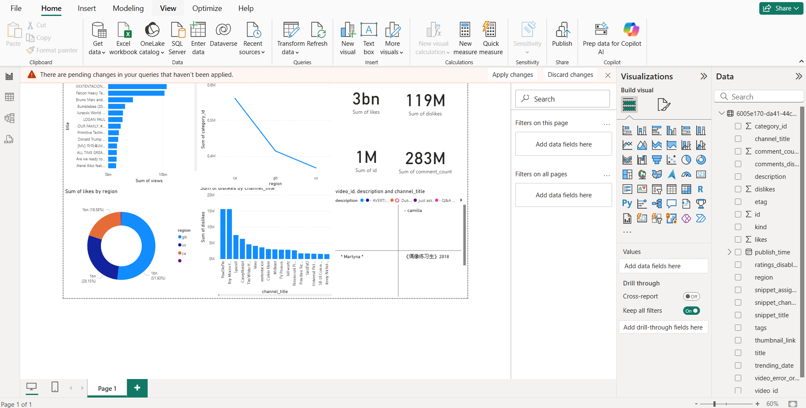

# Structure
### Glue Databases
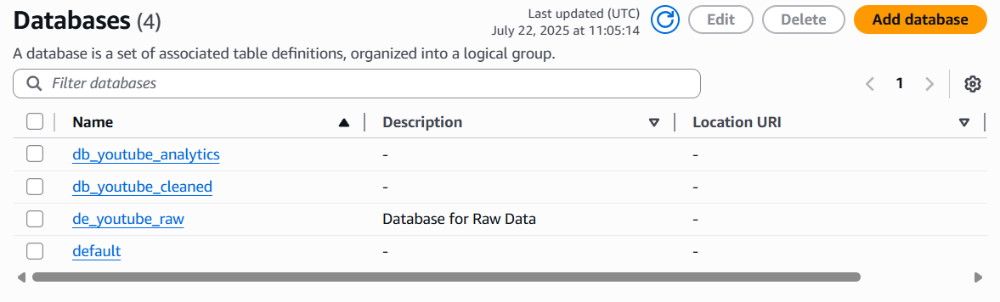

### S3 Buckets
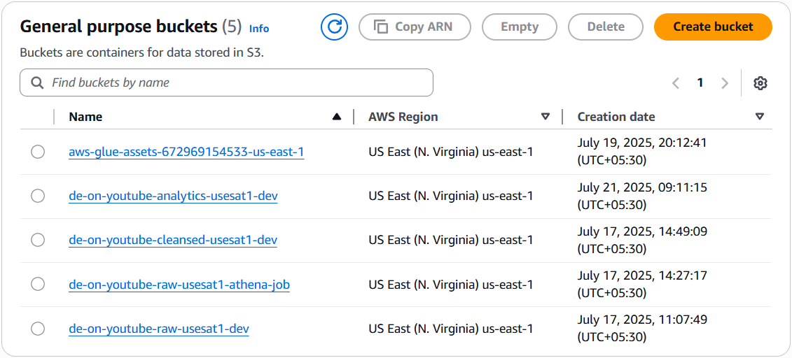

### Athena Test Query
```bash
SELECT * FROM "db_youtube_cleaned"."raw_statistics" a
INNER JOIN "db_youtube_cleaned"."cleaned_statistics_reference_data" b ON a.category_id = b.id
WHERE region = 'ca';
```

```bash
SELECT * FROM "db_youtube_analytics"."final_analytics";
```

### Lambda Function
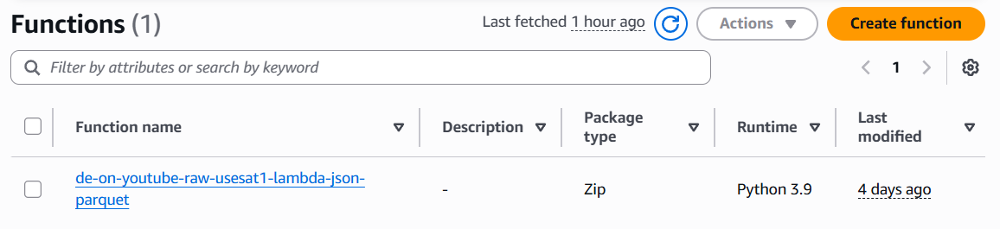

### CloudWatch Group Logs
```bash
Need to create
/aws/lambda/de-on-youtube-raw-usesat1-lambda-json-parquet
```

### Trigger to automate cleaning process
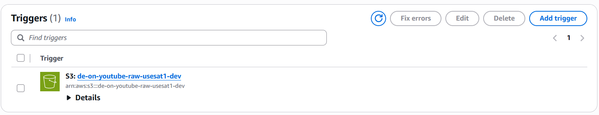

### ETL Jobs
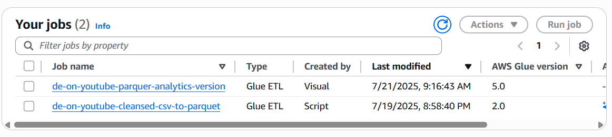

### ETL Jobs Monitoring
